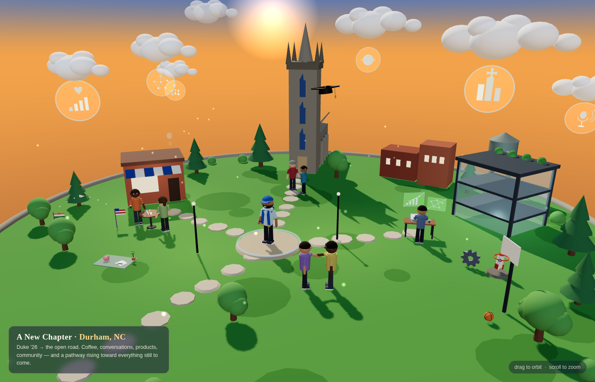

# A New Chapter — Durham, NC (3D Diorama)

An interactive, cinematic 3D miniature world of life right after graduating
from Duke University: standing at the center of a Durham-inspired island in a
Duke-blue cap and graduation stole, surrounded by the moments of a new
chapter — Duke Chapel with a floating grad cap, a brick café with friends over
coffee, a glass startup workspace with holographic product dashboards, a
handshake at a networking moment, a mentor conversation, and a glowing pathway
of stepping stones rising off the island toward the future. Soft clouds carry
holographic visions of goals: a strong network, an innovative company,
confident speaking, community, products that help people, and global
leadership. Small symbols mark the journey: India and US flags joined by a
paper-plane arc, an engineering gear, a startup rocket, a basketball hoop, a
meditation lotus, an open journal, and a sapling.

## Run it

Open `index.html` in any browser — it is fully self-contained (Three.js r128
is inlined, no network access needed). Drag to orbit, scroll to zoom; the
camera slowly auto-rotates until you interact.

A deep-link camera is supported via the URL hash:
`index.html#cam=x,y,z,tx,ty,tz` (camera position and orbit target).

## Structure

- `index.html` — the built, self-contained page (Three.js + controls + scene inlined)
- `src/scene.js` — the scene source: island, characters, buildings, clouds, holograms, animation loop
- `src/body.html` — page shell: styles, title card, hint

To rebuild `index.html` after editing the sources, concatenate
`src/body.html`, then `three.min.js` (r128), `OrbitControls.js` (r128
examples), and `src/scene.js`, each script in its own `<script>` tag, inside a
standard HTML5 document.
