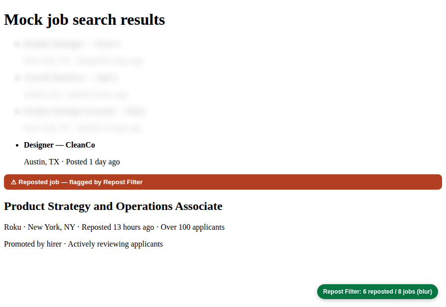

# LinkedIn Reposted Job Filter

A tiny Chrome extension that cleans up your LinkedIn job search by getting rid
of the **"Reposted"** jobs that clutter the results. Pick how you want them
handled: **blur** them out, **hide** them completely, or **grey** them out.

## What it does

When you're on LinkedIn job search results, the extension scans every job card
and finds the ones LinkedIn labels "Reposted …". Depending on your setting it:

- **Blur** (default) — covers the card with a blur so you can ignore it, but the
  slot stays so the layout doesn't jump.
- **Hide completely** — removes reposted jobs from the list entirely.
- **Grey out** — fades them; hover to reveal if you want a peek.

It keeps working as you scroll (LinkedIn loads jobs lazily) and as you move
between searches.

## Install (load unpacked)

1. Download / clone this folder (`linkedin-repost-filter`).
2. Open Chrome and go to `chrome://extensions`.
3. Turn on **Developer mode** (top-right toggle).
4. Click **Load unpacked** and select the `linkedin-repost-filter` folder.
5. Open [LinkedIn Jobs](https://www.linkedin.com/jobs/), and reposted jobs will
   be filtered. Click the extension icon to switch modes or toggle it off.

> If LinkedIn was already open, refresh the tab after installing.

Works in Chrome, Edge, Brave, and other Chromium browsers (Manifest V3).

## Settings

Click the toolbar icon to:

- Toggle the filter on/off.
- Choose **Blur**, **Hide completely**, or **Grey out**.
- See a live **count** of how many reposted jobs were found on the current page.

Settings sync via your Chrome profile and apply instantly to open job tabs.

## How it works (under the hood)

- `inject.js` runs in the page's MAIN world and patches `fetch` /
  `XMLHttpRequest`. LinkedIn renders the job list from its internal "Voyager"
  JSON API, and that JSON carries the repost status (a repost flag and/or
  `originalListedAt` vs `listedAt`) even when the visible card only says
  "Posted". The interceptor reads those responses and posts the reposted job
  IDs to the content script via `window.postMessage`.
- `content.js` collects job cards, reads each card's job ID, and marks it
  reposted if the API flagged that ID (primary signal) or the card text says
  "Reposted" (fallback). A `MutationObserver` re-applies the filter as new
  cards stream in during infinite scroll.
- `content.css` holds the three visual treatments.
- `popup.html` / `popup.js` are the settings UI, backed by `chrome.storage.sync`.
  The popup asks the active tab's content script for a live reposted-job count.

This API-based detection is the key trick: the rendered list often hides the
"Reposted" label (it only appears in the detail pane), but the underlying data
still contains it — so we read the data, not the pixels.

### Detail-pane detection & memory

The most reliable signal of all: when you click a job, the detail pane spells
out "Reposted N hours ago". The extension reads that pane, shows a red
"⚠ Reposted job" banner on it, blurs/hides the job's card in the list, and
**remembers the job id** (in `chrome.storage.local`, capped at 3000 ids) — so
once a repost is spotted it stays filtered in every future search, even where
the list card only says "Posted".

It's purely **visual** — it never clicks, scrolls, or interacts with jobs on
your behalf, so it doesn't touch how LinkedIn ranks or feeds you listings.

### One-click page scan

Click **"Scan this page for reposts"** in the popup (or press **Alt+Shift+S**
on the page). The extension scrolls the list to load every card, then opens
each job briefly at a human pace (~2s per job, max 40 per run) so the detail
pane reveals reposts, which get flagged, blurred, and remembered. Progress
shows in the orange badge; click the badge to stop. Jobs verified clean are
remembered for the session and never re-opened.

Note: scanning opens each job the way a click does, so scanned jobs are marked
"Viewed" on your account. It runs only when you trigger it, one page at a time.

## Notes / limitations

- LinkedIn changes its markup often. The matching is based on the visible
  "Reposted" text, which is the most stable signal — but if LinkedIn relabels
  it, matching may need an update.
- No data leaves your browser. The extension only needs `storage` and access to
  `linkedin.com`.
